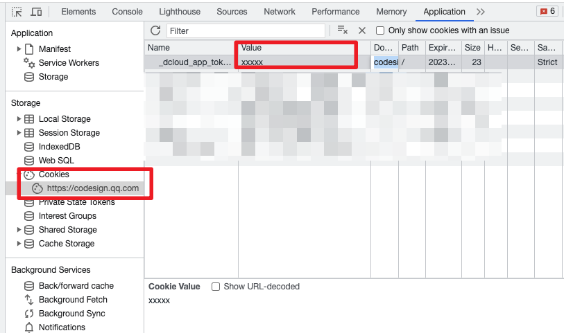
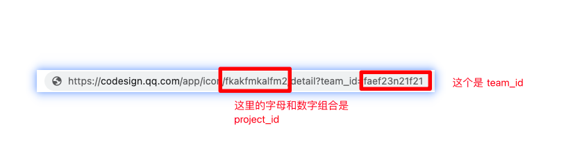

# iconfont_to_codesign

#### Description

Automatically migrate icon on iconfont to icon library in codesign

#### Software Architecture

##### Environment

* python >= 3.8

#### Installation

1. Fill in `token` and `project_ id` in the `config.yaml` configuration file
2. `pip install-r environments.txt`
3. `python main.py`

#### Instructions

1. To get the token, click `F12`-> `Application`-- > `Storage`-> **_dcloud_app_token_**in `Cookies`！
    > if it is not found in `Cookies`, you can look for **_dcloud_app_token_** in `Cookies`.
2. Creating an icon library will automatically jump to an address link that should be: `project_id` in which copy the string from`icon/`to the front of `/ detail` this is project_id. 

3. Download the icon list from `iconfont` and place it as shown. 
4. Then after the environment is ready, `python main.py`
5. After uploading, if you want to verify whether the data on both sides are consistent, you can run the command `python verify_ sync.py`

#### Contribution

1. Fork the repository
2. Create Feat_xxx branch
3. Commit your code
4. Create Pull Request
