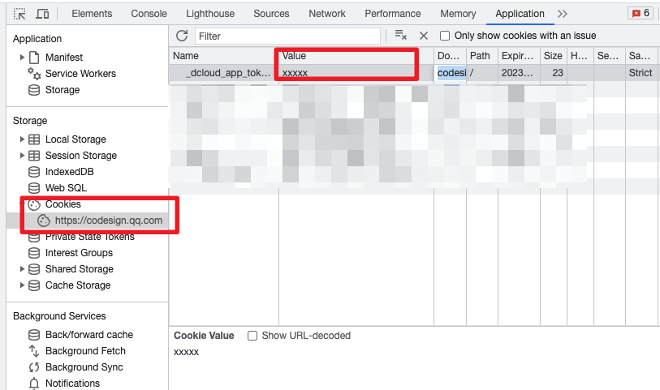

# iconfont_to_codesign

#### 介绍

将iconfont上的icon自动迁移到codesign的icon库中

#### 安装教程

##### 环境

* python >= 3.8

#### 快速使用

1. 填写 `config.yaml` 配置文件中的`token`和`project_id`
2. `pip install -r requirements.txt`
3. `python main.py`

#### 使用说明

1. 获取token，点击`F12` -->`Application`--->`Storage`--->`Cookies` 中的 **_dcloud_app_token_**  

> 若`Cookies` 内未找到，可在 `Local Storage` 内寻找**_dcloud_app_token_**

2. 创建一个图标库 会自动跳转到一个地址 链接应该为： `https://codesign.qq.com/app/icon/{project_id}/detail?team_id={team_id}`  其中将`icon/` 后面 到`/detail`前面的字符串复制下来  这个是 project_id 
3. 接着在环境准备完毕后 `python main.py`

#### 参与贡献

1. Fork 本仓库
2. 新建 Feat_xxx 分支
3. 提交代码
4. 新建 Pull Request
